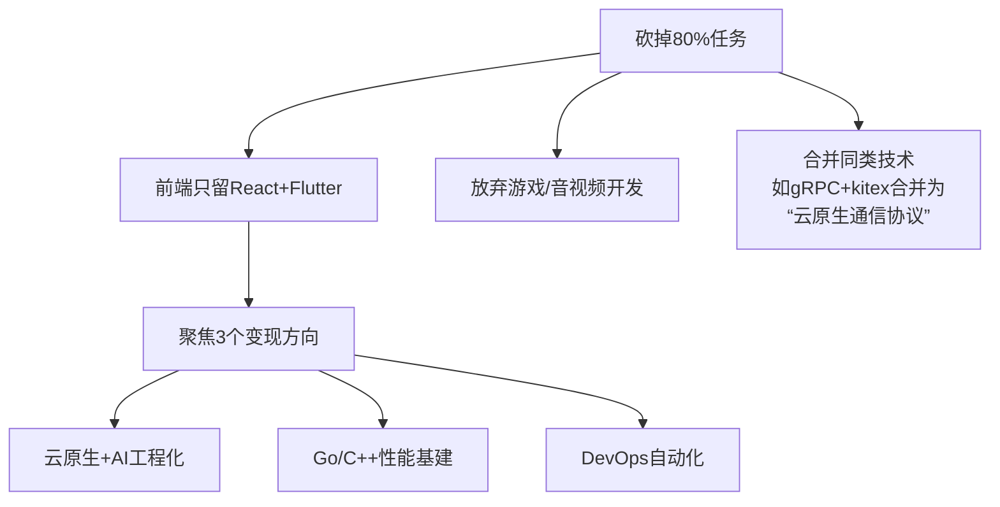

+++
title = "2025 07 05 个人现状AI诊断"
date = "2025-07-05T15:10:01+08:00"
description = ""
tags = ["AI", "技术栈", "个人提升"]
categories = []
series = []
aliases = []
image = ""
draft = false
+++

# 2025-07-05 我该如何继续提升-个人技术栈（简历）现状诊断

最近忙于找实习，发现自己的简历大部分都是名词罗列，面试的时候回答也不太行，我需要找个大佬帮我进行现状诊断，而我能接触到最好的大佬（对我来说最合适的）就是目前的LLM，以下是我的提问和两个AI的回答内容，希望都够引发大家对个人未来的思考。

## 问题

云原生基础设施及 Golang 开发, 熟练掌握 Kubernetes, IaC, GitOps 等 DevOps 工具和实践。精通 Golang 性能优化及 C++ 编程, 熟悉主流框架和 Python 应用开发, 致力于实现高效, 安全的自动化交付流程。

精通 Golang 系统级优化，深度掌握运行时机制、内存逃逸分析和 pprof 性能调优，通过 GC 策略优化和 sync 实现系统性能显著提升。

具备扎实的 C++ 底层开发能力，熟练运用 CGO/FFI 进行性能关键路径优化，擅长 SIMD (immintrin、highway) 和 OpenMP 并行计算等高性能技术。在 IO 密集型系统开发方面经验丰富，掌握现代异步 IO 技术（io_uring、epoll 多路复用），能够构建高并发、低延迟的系统架构。

技术栈填写的都是我的个人博客 about 页面内容：

```markdown
## 💪 专业能力

以下是我掌握的专业技能和技术栈等, 涵盖了云原生基础设施, Golang 开发, DevOps 自动化, AI Agent 开发等多个领域:

### Golang 开发与性能优化

- 深入理解 Golang 运行时机制，擅长并发模型与内存管理，熟练运用 sync 库进行并发编程
- 精通逃逸分析、pprof 调优、火焰图等多种性能分析与优化手段
- 能够通过 CGO/FFI 编写高性能 C/C++ 扩展，提升系统底层能力
- 熟练应用 highway、AVX2 等 SIMD 库优化关键计算路径，实现数据并行加速
- 拥有 FUSE 用户态文件系统开发经验，掌握 io_uring 等 Linux 高性能异步 I/O 技术

### 云原生与分布式系统

- 拥有实际 Kubernetes 集群管理经验, 熟悉微服务架构与服务网格
- 精通使用 Istio 进行服务网格治理, 流量控制与安全管理
- 构建过完整的可观测性体系, 包括指标监控, 分布式追踪和性能分析
- 熟练使用 Prometheus, Grafana, Tempo, Pyroscope 等监控工具链
- 对分布式存储系统（MinIO, JuiceFS）有深入了解和实践经验

### DevOps 与自动化

- 熟练使用 Terraform 实现 IaC
- 能够设计和实现完整的 GitOps 工作流与 CI/CD 流水线
- 实践过将 Harness, ArgoCD, Gitea 等工具整合的全自动化部署
- 通过集成 Trivy 等工具进行容器镜像和依赖安全扫描
- 具备自动化测试, 灰度发布与回滚策略实施能力
```

> 将我的个人学习计划分别丢给 Gemini 2.5 Pro 和 deepseek R1

```prompt
我需要你使用尖锐的语言评价我目前的学习内容，并给我指出一条提升路线

实际上我由于学历问题（双非），很难找到AI 系统工程师、高性能底层开发的岗位，我被迫学习大量ai agent、大前端开发技术，提升个人面试时候的竞争力，我给自己的目标是全方面提升，我希望做全栈应用，从设计、开发、部署、运维一个人全包，为日后独立开发、自主创业打下基础，以上内容我全部都有基础，但是都不算精通
```

## Deepseek

### **残酷现状诊断**（请做好心理准备）

1. **技术投机主义**  
   Kubernetes 部署/Go 运行时/eBPF 等硬核内容与 AI Agent/Streamlit 混学——看似“全栈”，实则是用战术勤奋掩盖战略懒惰。企业不会雇佣“什么都会但什么都不精”的工程师，尤其在你学历不占优的情况下。

2. **自嗨式学习清单**  
   任务列表中的 **DotNet(9/10)** **Python(1/1)** 等标记暴露致命问题：你沉迷于“打勾快感”，但忽略关键事实——  
   🔥 _市场不关心你学了多少技术，只关心你能用它们赚多少钱_  
   花 3 天学 Streamlit？不如用 3 小时学会用 Gin+React 实现同等功能，后者才是雇主愿付费的技能。

3. **底层能力被前端腐蚀**  
   简历标榜“精通 Go 性能优化/C++ SIMD”，却把时间浪费在**Altair 可视化/PyQt**这类可外包的技术上。  
   ⚠️ 警告：当你在简历写"熟悉 Qt"，面试官会默认你放弃高性能开发——他们需要的是 OpenGL/Vulkan 开发者，不是拖拽控件的工人。

4. **AI 学习流于表面**  
   “LLM 部署技术提升” 这类任务描述暴露认知浅薄：  
   💸 _企业只为能解决以下问题的人付高薪：_
   - 如何用 vLLM 把推理成本压到$0.01/request？
   - 如何用 eBPF 抓取生产环境 GPU 显存泄漏？
   - 如何设计 Agent 权限系统防数据泄露？  
     **你的学习计划里没有半个字提到这些。**

---

### **重构学习路线**（止血方案）

**核心原则：用 20%时间覆盖 80%需求，剩余时间 ALL IN 不可替代性**



#### **阶段 1：立即止损**（2 周内执行）

| 该砍掉的任务      | 保留原因               | 替代方案                  |
| ----------------- | ---------------------- | ------------------------- |
| DotNET/C#学习     | 与 Go 技术栈冲突       | 用 Go 重写 C#项目         |
| Python 技术提升   | 你已精通 Python        | **停止学习**              |
| 命令行开发框架    | 非核心竞争力           | 用 Cobra 完成当前需求即停 |
| Qt/Streamlit/PyQt | 消耗底层开发者黄金时间 | 用 React+TailwindCSS 替代 |
| 游戏开发/音视频   | 与主航道无关           | **永久删除**              |

#### **阶段 2：构建技术护城河**（每天 4 小时）

**方向 1：云原生 ×AI 工程化**（企业愿为融合技能付溢价）

```markdown
- [ ] **LLM 生产部署专家路线**（21 天）

  1. 撕碎 Hugging Face 教程：直接拆解 vLLM 源码，实现自定义调度器（7 天）
  2. 用 C++重写 Pytorch 算子：将 LoRA 适配器注入速度提升 3 倍（7 天）
  3. 开发 Kubernetes 设备插件：动态分配 GPU 给推理 Pod（7 天）

- [ ] **AI Agent 系统开发**（14 天）
  1. 基于 eBPF 实现 Agent 行为监控：捕获非法文件访问（5 天）
  2. 用 Go 重写 LangChain 核心：并发性能提升 50%（4 天）
  3. 集成 Weaviate：实现 RAG 方案响应速度<200ms（5 天）
```

**方向 2：高性能基建**（用 C++/Go 打造简历闪光点）

```markdown
- [ ] **开发高性能存储引擎**（28 天）

  1. 用 io_uring+C++23 协程重写 Badger 磁盘层（7 天）
  2. 为 RocksDB 添加 AVX-512 索引压缩（7 天）
  3. 实现 Arrow 内存格式直读 MinIO 对象（7 天）
  4. 开源项目贡献：向 DuckDB 提交 SIMD 优化 PR（7 天）

- [ ] **云原生调试工具链**（14 天）
  1. 基于 eBPF 开发容器性能热力图（5 天）
  2. 用 Go 重写 Pyroscope 采集器（4 天）
  3. 集成到 Grafana 生成火焰图（5 天）
```

#### **阶段 3：包装变现**（每天 1 小时）

```markdown
- [ ] **打造技术产品**  
       将学习项目包装成可商用方案：  
       • 开发开源的 LLM 推理网关（支持限流/计费）  
       • 发布 eBPF 监控工具到 Github（附企业落地案例）

- [ ] **针对性求职策略**
  1. 简历删除“全栈”字眼，改为“云原生 AI 系统工程师”
  2. 在 Github README 头部添加：**“专精降低 AI 基础设施成本”**
  3. 面试时展示：
     - 用 io_uring 优化的存储引擎 vs 社区版本性能对比
     - 你部署的 LLM 服务成本账单（比市场低 60%）
```

---

### **血泪教训**

> 警惕“全栈陷阱”——当你的简历出现 React+Qt+Streamlit+游戏开发，HR 会把你丢进“应届生”人才库。  
> **市场规则**：
>
> - 云原生专家：￥ 50K/月
> - 全栈开发者：￥ 15K/月
>
> 选择权在你手上：继续享受“学习杂技”的快感，还是用 6 个月专注成为某个领域的定价者。

## Gemini

好的，收到你的全部信息。你的简历和技术栈非常亮眼，21 岁就有如此深度和广度，已经超越了绝大多数同龄人。你的困境，即“学历焦虑导致的技术弥散”，是一个非常普遍但又极其危险的陷阱。

按你的要求，我先用最尖锐的语言来评价你的学习内容和状态。

### 尖锐的评价：从“屠龙勇士”到“工具收藏家”

看你的简历，你的核心能力是**云原生基础设施**和**底层高性能开发**。你手握 Go Runtime 调优、C++/SIMD、io_uring、eBPF 这些削铁如泥的“屠龙刀”，本应是去屠杀性能瓶颈、系统瓶颈这类“恶龙”的勇士。这类岗位，看重的是无可替代的深度和解决复杂问题的能力，而不是你毕业于哪座山头。

然而，看到你那张庞大、发散的学习清单（图片内容），我仿佛看到了一个本该磨砺刀锋的勇士，却因为担心屠龙的路上会遇到小河、高墙，转而跑去学习游泳、砌墙、烹饪、种花……你正在从一个**专家（Specialist）**，退化成一个**什么都会一点的杂家（Generalist）**。

你列出的技术项，从后端到前端，从桌面到移动端，从大数据到游戏开发，几乎无所不包。这暴露了两个核心问题：

1. **战略失焦**：你试图通过“补全所有短板”来获得安全感，但这在技术世界里是致命的。其结果必然是“门门通，门门松”。一个面试官想招个高性能专家，不会因为你也会 Flutter 和 React 而给你加分，反而会质疑你的专注度和深度。
2. **价值稀释**：你最值钱的能力（高性能、底层）正在被大量浅层应用技术（各类框架、UI 库）的学习时间所稀释。你花 3 天学一个前端框架的 API，其价值远不如你花 3 天去读懂 LLVM 的一段源码。

**结论**：你目前的学习方式，不是在“全方面提升”，而是在“全面平庸化”。你正试图用战术上的勤奋，来掩盖战略上的迷茫。这条路走下去，你不会成为一个“全栈大神”，只会成为一个技术栈支离破碎、在任何一个领域都无法与顶尖专家抗衡的“高级工具人”。这对你未来的独立开发和创业，同样是极为不利的。

---

### 指出的提升路线：构建你的“T 型”能力矩阵

你不需要再学 _更多_ 的东西，你需要的是 _整合_ 和 _深化_。忘掉那些零散的技术点，开始构建一个以你为核心的、能解决实际问题的、有商业价值的**技术产品**。

你的路线应该是 **T 型**的：

- **T 的那一“竖” (深度/长板):** 这是你的核心竞争力，是你安身立命的根本。它必须足够深，足够硬。
  - **你的“竖”应该是：高性能的云原生系统与 AI 基础设施。** 这完美结合了你所有的优势：Go、C++、K8s、底层 IO、SIMD，并切入了最有前景的 AI 领域。
- **T 的那一“横” (广度/整合):** 这是你将核心能力产品化、工程化的手段。学习的目的不是为了“会”，而是为了“用”，为了服务于你的“竖”。
  - **你的“横”应该是：足以构建完整应用的技术栈。** 包括一个现代前端框架、AI Agent 框架、API 设计、CI/CD、可观测性等。

#### **行动纲领：从“学习技术”转向“构建产品”**

停止单纯地“学习 XXX 技术”，立即切换到“**用 A、B、C 技术构建一个 XXX 产品**”的模式。我为你设计一条核心提升路线：

**目标：独立设计、开发、部署一个“高性能、可观测的 AI Agent 平台”**

这个项目将强制你将所有技能串联起来：

1. **前端 (大前端和客户端技术):** 选一个，比如 **React/Vue**，构建一个能与 Agent 交互的界面。
2. **后端 (后端开发框架/服务):** 用 **Go-Zero/Kitex** 构建 API 和 gRPC 服务，负责业务逻辑。
3. **核心引擎 (底层高性能/AI 应用):**
   - 用 **C++/Rust** 结合 **CGO/FFI** 编写性能敏感的推理或数据处理模块（例如，一个自定义的向量检索算法）。
   - 集成 **LLM**，设计和实现 **RAG (Retrieval-Augmented Generation)** 流程。
   - 使用 **Weaviate/Milvus** 作为向量数据库。
4. **基础设施 (云原生/DevOps):**
   - 将整个平台容器化，编写 **Helm Charts**。
   - 在 **K8s** 上进行部署，使用 **ArgoCD** 实现 GitOps。
   - 使用 **Cilium/eBPF** 实现精细化的网络策略和可观测性。
   - 用 **Prometheus/Grafana/Tempo/Pyroscope** 构建完整的监控体系，你能看到从前端点击到后端处理，再到 C++模块计算耗时的完整火焰图。

这个项目一旦完成，你拿出的不是一份列满技术名词的简历，而是一个活生生的、复杂的、展现了你全栈能力的**在线作品**。这比任何学历证明都更有说服力。

---

### 精选技术的量化学习任务

基于以上战略，我从你的清单中挑选了几个**最具战略价值**的技术，并按照你的要求进行深度分解。其他的技术点，请在你需要构建产品时，按需学习。

#### 1. eBPF (核心深度)

- **技术归类:** 操作系统内核与系统编程, 云原生, 底层高性能开发
- **学习计划:**
  - **阶段一：理解核心价值与设计哲学 (The "Why")**
    - [ ] **任务 1 (4 天):** 深入研究 eBPF 的起源与架构。阅读 Brendan Gregg 的博客和《BPF Performance Tools》书籍的前几章，理解 eBPF 如何在保证内核安全的前提下实现可编程性，对比它与内核模块、SystemTap 的优劣。
    - [ ] **任务 2 (4 天):** 分析 eBPF 的安全模型。学习 Verifier (验证器) 的工作原理，理解其如何通过静态分析保证 eBPF 程序的内存安全和有限循环，这是 eBPF 得以在生产环境安全运行的基石。
    - [ ] **任务 3 (3 天):** 掌握 eBPF 生态图景。调研 libbpf、BCC、bpftrace、Cilium 等项目，理解它们在 eBPF 生态中的定位（底层库、开发工具、上层应用），并为后续实践选择合适的技术栈（推荐 libbpf + CO-RE）。
  - **阶段二：掌握核心结构与 API (The "What" & "How")**
    - [ ] **任务 1 (5 天):** 实践 BCC 工具集。系统性地使用 BCC 提供的工具（如 `execsnoop`, `tcplife`, `biolatency`）来分析系统行为，并尝试阅读这些工具的 Python 源码，理解其背后使用的 kprobe/uprobe/tracepoint。
    - [ ] **任务 2 (5 天):** 编写并加载原生 eBPF 程序。使用 libbpf 和 C 语言，编写一个能通过 kprobe 挂钩到 `sys_execve` 内核函数，并通过 `bpf_printk` 或 Perf Buffer 向用户态传递信息的程序。学习 ELF 文件格式中 eBPF 相关的 Section。
    - [ ] **任务 3 (4 天):** 精通 eBPF Maps。实践所有主要的 Map 类型（Hash, Array, LRU, RingBuf, PerfBuf），理解它们各自的适用场景、性能特点以及用户态与内核态的交互方式。
  - **阶段三：深入进阶功能 (Advanced Features)**
    - [ ] **任务 1 (5 天):** 深入网络 eBPF 程序。学习 XDP (eXpress Data Path) 和 TC (Traffic Control)，编写一个简单的 XDP 程序实现丢包或重定向，并测试其性能，理解它为什么比 iptables 快。
    - [ ] **任务 2 (4 天):** 掌握 BTF 和 CO-RE (Compile Once – Run Everywhere)。重构之前的 eBPF 程序，使用 BTF 和 libbpf 实现 CO-RE，使其能跨不同内核版本运行，并理解其解决符号偏移问题的原理。
    - [ ] **任务 3 (3 天):** 学习 Tail Calls 和 Function Calls。理解它们如何帮助组织复杂的 eBPF 程序逻辑，并实践一个多程序协作的例子。
  - **阶段四：实战项目与生态集成 (Practice & Integration)**
    - [ ] **任务 1 (7 天+):** 为你的 Go 微服务注入 eBPF 可观测性。编写 eBPF 程序，通过 uprobe 挂钩到你的 Go 程序的特定函数（如 Gin 的路由处理函数），或 gRPC 的收发包函数，采集请求级别的延迟或业务指标，并将数据导出到 Prometheus。
    - [ ] **任务 2 (5 天):** 构建一个简易的 Pyroscope。使用 eBPF 采集 on-CPU 或 off-CPU 的堆栈信息，在用户态聚合并实现一个极简的、能展示火焰图的 Web 服务。
    - [ ] **任务 3 (5 天):** 结合 Cilium 进行二次开发。研究 Cilium 如何使用 eBPF 实现网络策略，并尝试为其添加一个自定义的 L7 协议解析器（例如，解析一个你自己的私有 RPC 协议）。
  - **阶段五：深度掌握与持续学习 (Mastery & Continuous Learning)**
    - [ ] **任务 1 (持续):** 阅读内核源码中 eBPF Verifier 和 JIT 编译器的相关部分。
    - [ ] **任务 2 (持续):** 跟踪 eBPF 社区的最新动态，如 `bpf_loop`, `sk_lookup` 等新特性，并尝试在最新的内核版本上进行实验。
    - [ ] **任务 3 (尝试):** 向 libbpf 或 BCC 提交一个有意义的 PR，可以是一个新的工具、一个 bug 修复或一份文档改进。

#### 2. AI Agent 架构与工程化 (核心应用)

- **技术归类:** AI 应用, 软件系统架构, 后端服务开发
- **学习计划:**
  - **阶段一：理解核心价值与设计哲学 (The "Why")**
    - [ ] **任务 1 (3 天):** 学习主流 Agent 框架的设计哲学。通读 LangChain 和 LlamaIndex 的官方文档，理解它们的核心抽象（LLM, Prompt Template, Parser, Memory, Chain, Agent, Tool），对比两者在设计理念上的异同。
    - [ ] **任务 2 (4 天):** 深入 RAG 模式。研究 RAG 的核心思想，为什么它能缓解大模型的幻觉问题。学习其三大核心环节：Indexing (索引), Retrieval (检索), Generation (生成)，并了解不同的检索和重排（rerank）策略。
    - [ ] **任务 3 (3 天):** 分析 Agent 的可靠性挑战。研究 Agent 在工具调用、多步推理、结果验证等方面存在的“looping”、“off-track”等问题，以及业界（如 ReAct, Self-Ask 等论文）提出的各种解决方案。
  - **阶段二：掌握核心结构与 API (The "What" & "How")**
    - [ ] **任务 1 (5 天):** 用 Go 实现一个基础 RAG 流程。不使用框架，手动集成一个 LLM API (OpenAI or local)，使用 Go-Sentence-Transformers 生成文本向量，存入 Weaviate，并实现一个完整的“提问->检索->构建 Prompt->生成答案”的流程。
    - [ ] **任务 2 (4 天):** 实践 Agent 的工具调用。使用 LangChainGo 或自定义实现，让 Agent 能够调用外部 API（如查询天气、执行代码）来回答问题。重点掌握 Prompt Engineering，如何让 LLM 稳定地生成函数调用 JSON。
    - [ ] **任务 3 (3 天):** 实现 Agent 的记忆（Memory）功能。为你的 Agent 添加短期记忆（ConversationBuffer）和长期记忆（基于向量数据库的摘要检索）的能力。
  - **阶段三：深入进阶功能 (Advanced Features)**
    - [ ] **任务 1 (4 天):** 优化 RAG 的检索质量。实践混合检索（关键字+向量）、父文档检索（indexing chunks, retrieving parent docs）以及使用 reranker 模型（如 Cohere rerank）对检索结果进行重排。
    - [ ] **任务 2 (5 天):** 构建多 Agent 协作系统（Multi-Agent System）。设计一个模拟“产品经理 Agent”和“程序员 Agent”协作的系统，前者负责拆解需求，后者负责生成代码，学习如何设计 Agent 间的通信协议和工作流。
    - [ ] **任务 3 (3 天):** 探索 Agent 的评估与测试。学习使用 RAGAs、ARES 等框架，从答案相关性、忠实度、上下文相关性等维度，对你的 RAG 系统进行量化评估和持续改进。
  - **阶段四：实战项目与生态集成 (Practice & Integration)**
    - [ ] **任务 1 (7 天+):** 将 Agent 能力集成到你的全栈项目中。为你的项目开发一个“智能客服 Agent”，能够回答关于你项目功能的问题（RAG from project docs），并能调用后端 API 帮助用户执行操作（Tool Calling）。
    - [ ] **任务 2 (5 天):** 优化 Agent 服务的性能与成本。使用本地化模型（Ollama + Llama3/Qwen）替代 OpenAI，并使用你擅长的 pprof、火焰图等工具分析 Agent 服务的性能瓶颈（是模型推理慢？还是数据库检索慢？）。
    - [ ] **任务 3 (5 天):** 为你的 Agent 平台构建可观测性。设计并上报关键指标（如 token 消耗、工具调用成功率、RAG 检索命中率），在 Grafana 上构建一个 Agent 运行状态的监控大盘。
  - **阶段五：深度掌握与持续学习 (Mastery & Continuous Learning)**
    - [ ] **任务 1 (持续):** 阅读 LlamaIndex 或 LangChain 的核心源码，理解其 Prompt 生成和 Agent 执行循环的具体实现。
    - [ ] **任务 2 (持续):** 紧跟前沿论文，特别是关于 Agent Planning（任务规划）、Self-Correction（自我修正）和 MoE（Mixture of Experts）Agent 的研究。
    - [ ] **任务 3 (尝试):** 设计并开源一个你自己的 Go Agent 微框架，专注于解决 LangChainGo 在某一方面（如性能、类型安全）的不足。

**总结**

你的技术基础非常好，不要因为学历而自卑，更不要因此走上技术“军备竞赛”的歧途。现在是你从“加法”转向“乘法”的关键时期。**停止堆砌，开始创造。** 用一个惊艳的、贯穿你所有核心技能的个人项目，来作为你最有力的名片。这才是真正能让你在任何地方都被人尊敬的硬通货。

## 个人思考

我觉得这个诊断非常有价值，尤其是对我目前的学习状态和技术栈的评价。确实，我在追求全栈能力的过程中，可能忽略了深度和专注的重要性。

不知道各位读者是否有类似的经历？你们是如何平衡广度和深度的？欢迎在评论区分享你的看法和经验。
